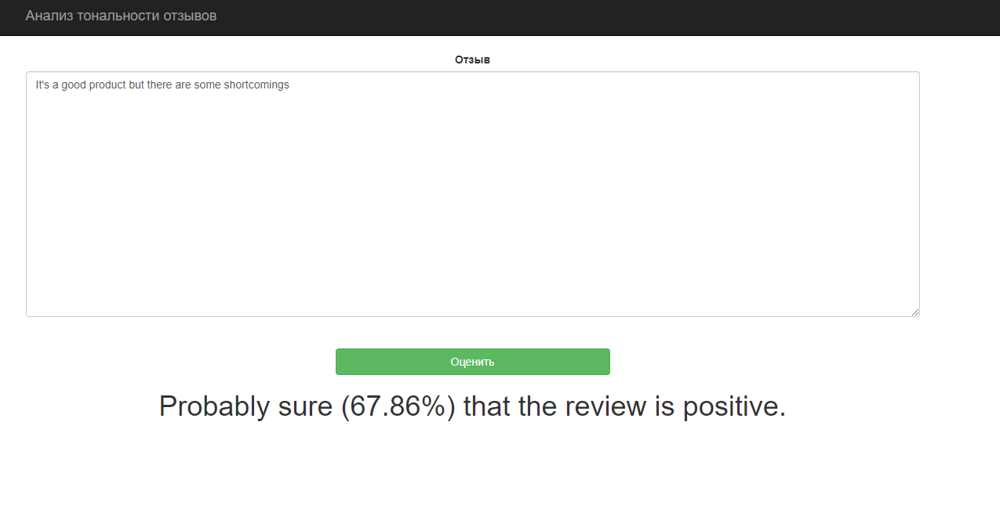
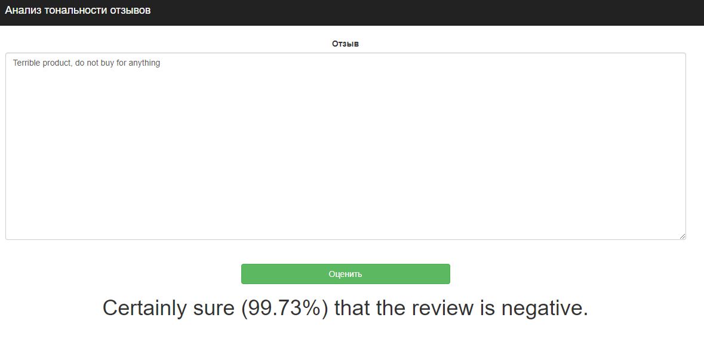
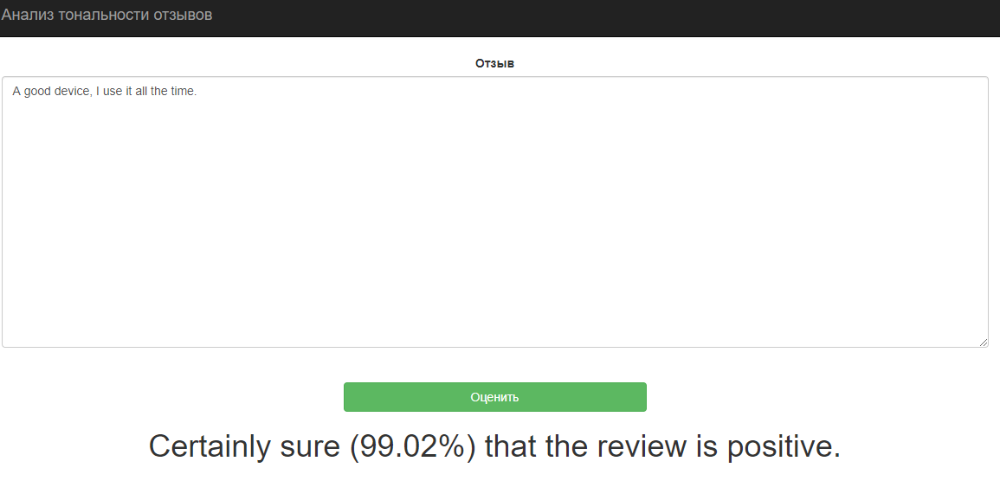

### Демо анализа тональности отзывов

**1. Установка необходимых библиотек**

<code>pip install flask flask-bootstrap flask_wtf wtforms joblib</code>

**2. Запуск демо**

- <code>python demo.py</code>

- Или запустить demo.py через IDEA

**3. Использование**

Открыть в браузере страницу:
- http://127.0.0.1:5050/

___

### На скриншотах примеры работы 
- Есть недостатки в продукте

- Негативный отзыв

- Позитивный отзыв

